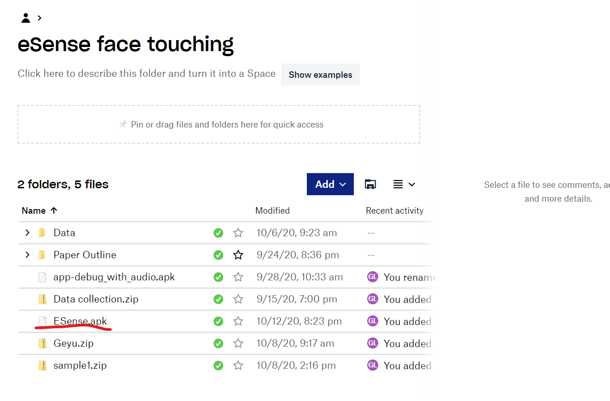

## Data Collection Guide

### Step 0: Download the apk file

1. Go to the eSense face touching folder
2. Download *ESense.apk* and install

### Step 1: Connect the ESense Earbud to your device

 
1. Long press the left side of earbud which has a *push button* (Location of push button is shown below)
until the LED starts blinking blue and red. Now in the host device you should see a new device with name *eSense-<Number>*

2. Connect the ESense as connecting the normal bluetooth device to your phone

3. After connect successfully, you can see the LED only blinking blue

### Step 2: Set the device setting according to the image below

1. Open the option menu
2. Click on *Setting*
3. Set the device setting according to the picture below
4. Click *save* button
5. Click the *connect* button in the main page

*Note*: Device ID should be set to the exact name as you see in step 1

### Step 3: Open the ESenseLog app and click reset connection (Skip this step if this is not first time you use the app)

1. Open the option menu
2. Click reset connection
3. Long press the *push button* on ESense until the LED flash red one time to shut down the device 
4. Repeat Step 1 again then click the *connect* button

Note: This will set the advertise interval to 20-40ms

### Step 4: Enter the participant name

1. Click on the *Participant Name* button and see the following dialog pop out

2. Enter the participant name and click save

### Step 5: Set the type of the motion you will need to perform

### Step 6: Enable/Disable the timer

### Step 7: Click the start button to start collection

### Step 8: Click *touch* button with another hand when you touch your face

### Step 9: Click the stop button after finishing one motion

### Step 10: Access the data file

1. Go to the file browser on the phone
2. Find the folder called *ESenseCategorized*
3. Access the data file categorized by participant name and motion

Note: *The last line of the excel file is the time stamp when touching happened* 

